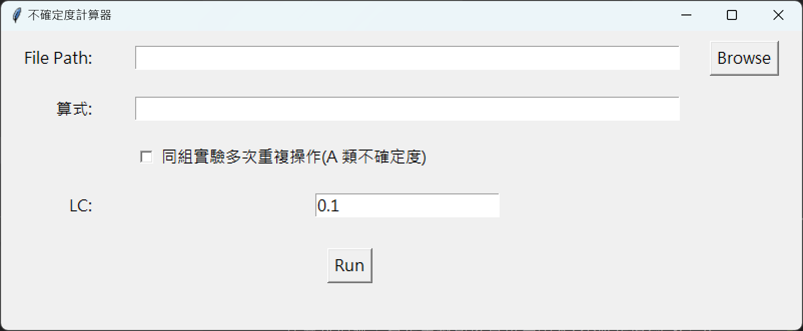

# 不確定度計算器
這個程式可以用來計算實驗數據，以及其不確定度，其用法如下

## 數據儲存
開啟一個 Excel 檔案，每個 column 儲存一種數據，每一個 row 儲存一次實驗的數據。可以查看 example

## 使用計算器
1. 開啟 "calculatorApp.exe"
2. file path 選擇建立好的 excel 表格
3. 算式就按照想要計算的方法，打出算式，支援變數四則運算及括號，若是常數可以直接寫出來(不確定度為 0，只能寫在變數後方)，可以參考範例做操作
4. lc 為變數最小刻度，用以計算不確定度
5. 若是相同數據製作，則要勾選計算 A 類不確定度
6. 按下計算後，會將計算結果儲存至與 Excel 表格相同資料夾中

## 使用例子(檔案皆在 example 資料夾中)
在這裡以物理課常用的焦距計算做示範
假設已經測量出 物距( $p$ ) 以及 像距( $q$ )
先將數據打在 Excel 表格中，儲存後選取此檔案

在公式的部分，透過成像公式 

可以移項得到

因此輸入 `p * q / (p + q)` 並確認最小刻度後，按下計算即可得到答案

